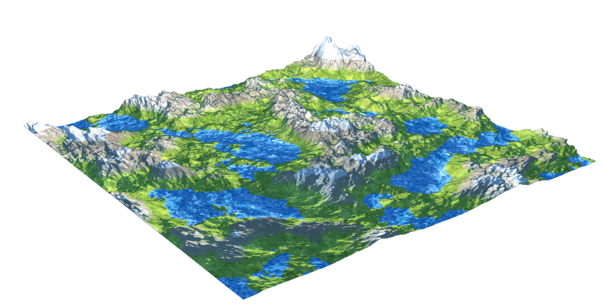

# WebGL-Procedural-Terrain-Generation
Procedural terrain generator in WebGL written for the Fundamentals of Computer Graphics course at ADA University. The project uses the Common library from the companion code of Interactive Computer Graphics (7th edition).

### Features
- Terrain generation with multiple Simplex noise octaves
- Terrain type assignment based on height
- Specular maps for different types of terrain
- Multitexturing (terrain blending) at terrain type edges
- Multiple lights
- Phong shading
- Camera movement
- Trackball movement
